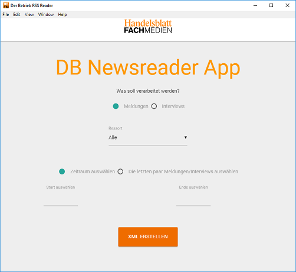
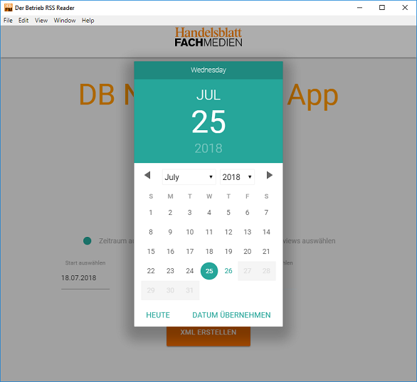

# Der Betrieb Online Meldungen für den Printprozess vorbereiten





## Nutzer Infos:

### Vorbereitungen:

**Es muss eine Java JRE installiert sein** und falls nicht schon vorhanden muss die JAR Datei der kostenlosen Saxon Home Edition im Anwendungsordner liegen: http://saxon.sourceforge.net/#F9.7HE

**Node/Npm muss installiert sein** am besten über [NVS](https://github.com/jasongin/nvs)

### Installation
* Mit der Kommandozeile `cmd` in ein Verzeichnis wechseln, in dem das Tool installiert werden soll, z.B. `cd c:\work`
* `git clone https://github.com/HB-Fachmedien/hbfm-db-rss-reader-tool`
* ins Verzeichnis wechseln `cd hbfm-db-rss-reader-tool`
* `npm install`
* kleinen Installationsbug aushebeln: `copy node_modules\materialize-css\js\date_picker\picker.js node_modules\materialize-css\bin`
* den oben runtergeladenen saxon.jar ins Verzeichnis ablegen
* Projekt starten mit `npm start`


### Anwendung
* Anwendung starten mit _hbfm-db-rss-reader-tool.exe_
* Auswählen, ob man Meldungen oder Interviews verarbeiten möchte
* Bei Meldungen kann man einzelne oder alle Ressorts auswählen
* Einen Zeitraum angeben aus dem die Interviews/Meldungen stammen sollen oder auswählen die wieviel aktuellsten Interviews/Meldungen verarbeitet werden sollen
* _XML ERSTELLEN_ Button startet den Abruf und wandelt die Daten in das passende InDesign XML Format
* Die erstellte InDesign XML Datei findet man im /output Ordner. Sie heißt _indesign.xml_. Diese in InDesign importieren

### Fehlerbehandlung
* siehe Vorbereitungen
* Bei jedem Anwendungsaufruf wird eine Logdatei mit dem Namen _log.txt_ erstellt.
* Diese bitte mit kurzer Fehlerbeschreibung an fz.ep@fachmedien.de schicken.

## Developer Infos:

### Install Bug
materialize-css hat noch einen Bug zur Zeit. Die Datei picker.js wird ins falsche Verzeichnis kopiert, siehe
https://github.com/Dogfalo/materialize/issues/3139

richtig wäre "cp node_modules/materialize-css/js/date_picker/picker.js node_modules/materialize-css/bin"

ich hoffe, der Bug wird bald bei materialize behoben

### Ausführbare exe Applikation bauen
```sh
$ npm run-script package
```
im /dist Ordner findet sich dann die Produktiv Version.
> **JEDOCH VORSICHT:**
> ich weiß nicht, ob ich die package.json fehlerhaft konfiguriert habe oder ob electron-packager gerade buggy ist, es der **node_modules** Ordner wird nicht komplett kopiert sowie saxon.jar und der xsl Ordner müssen noch in den Rootordner verschoben werden

### Falls der RSS Feed fehlerhaft ist:
In der Windows PowerShell den RSS Feed ziehen:
```sh
$client = new-object System.Net.WebClient
$client.DownloadFile("https://www.der-betrieb.de/feed/?cat=11","C:\temp\feed.xml")

```
Beachten, dass mittels JavaScript noch die CData Sektionen und die content:encoded Elemente 'replaced' werden.  
Dann die XSL Transformation (normalerweise mit den Parametern startDate=DD.MM.YYYY, endDate=DD.MM.YYYY, zeitraumOderDieLetztenX=zeitraum) manuell starten.

Zum Beispiel:
```sh
java -jar ./saxon9he.jar -s:./output/rss.xml -xsl:./xslt/transform_interview_to_indesign.xsl welcherNachrichtenTyp=interviews dieLetztenWieviele=1 welchesRessort=Alle zeitraumOderDieLetztenX=dieLetztenXItems possiblePubDate=NaN.NaN.NaN  -o:./output/indesign.xml
```

### ToDo
* Output Datei Bennenung
* fallback Lösung (wie ruft man den feed auf, wie sieht so ein fertiges XML aus?)
* Beispiel Dateien noch erläutern

**Build with Electron**
Learn more about Electron and its API in the [documentation](http://electron.atom.io/docs/latest).
